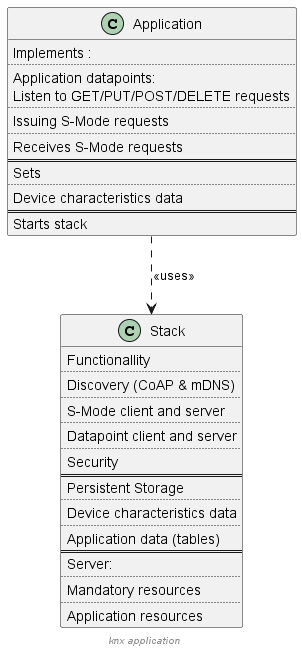

.. image:: https://github.com/KNX-IOT/KNX-IOT-STACK/actions/workflows/cmake-linux.yml/badge.svg
   :target: https://github.com/iKNX-IOT/KNX-IOT-STACK/actions/workflows/cmake-linux.yml

.. image:: https://github.com/KNX-IOT/KNX-IOT-STACK/actions/workflows/cmake-windows.yml/badge.svg
   :target: https://github.com/KNX-IOT/KNX-IOT-STACK/actions/workflows/cmake-windows.yml

.. image:: https://github.com/KNX-IOT/KNX-IOT-STACK/actions/workflows/doxygen.yml/badge.svg
   :target: https://github.com/KNX-IOT/KNX-IOT-STACK/actions/workflows/doxygen.yml

.. image:: https://github.com/KNX-IOT/KNX-IOT-STACK/actions/workflows/check-format.yml/badge.svg
   :target: https://github.com/KNX-IOT/KNX-IOT-STACK/actions/workflows/check-format.yml

Introduction
------------

KNX IoT Point API stack is an open-source, reference implementation of the KNX IoT standard for the Internet of Things (IoT). 
Specifically, the stack realizes all the functionalities of the KNX IoT Point API specification.

The responsibilities between the stack and an actual KNX IoT Point API device implementation is depicted in the following diagram:

The project was created to bring together the open-source community to accelerate the development of the KNX IoT Point API devices and services required to connect the growing number of IoT devices. 
The project offers device vendors and application developers royalty-free access  under the `Apache 2.0 license <https://github.com/KNX-IOT/KNX-IOT-STACK/blob/main/LICENSE.md>`_.

Stack features
-----------------------

- **OS agnostic:** The KNX IoT Point API device stack and modules work cross-platform (pure C code) and execute in an event-driven style. 
The stack interacts with lower level OS/hardware platform-specific functionality through a set of abstract interfaces. 
This decoupling of standards related functionality from platform adaptation code promotes ease of long-term maintenance and evolution of the stack through successive releases.

- **Porting layer:** The platform abstraction is a set of generically defined interfaces which elicit a specific contract from implementations. 
The stack utilizes these interfaces to interact with the underlying OS/platform. 
The simplicity and boundedness of these interface definitions allow them to be rapidly implemented on any chosen OS/target. Such an implementation constitutes a "port".

Project directory structure
---------------------------

api/*
  contains the implementations of `client/server APIs <https://knx-iot.github.io/KNX-IOT-STACK-doxygen/>`, the resources,
  utility and helper functions to encode/decode CBOR
  to/from data points (function blocks), module for encoding and interpreting endpoints, and handlers for the discovery, device
  and application resources.

messaging/coap/*
  contains a tailored CoAP implementation.

security/*
  contains resource handlers that implement the security model, using OSCORE.

utils/*
  contains a few primitive building blocks used internally by the core
  framework.

deps/*
  contains external project dependencies.

deps/tinycbor/*
  contains the tinyCBOR sources.

deps/mbedtls/*
  contains the mbedTLS sources.

include/*
  contains all common headers.

include/oc_api.h
  contains client/server APIs.

include/oc_rep.h
  contains helper functions to encode/decode to/from cbor

include/oc_helpers.h
  contains utility functions for allocating strings and
  arrays either dynamically from the heap or from pre-allocated
  memory pools.

port/\*.h
  collectively represents the platform abstraction.

port/<OS>/*
  contains adaptations for each OS.
  Platforms:
  
  - Linux
    storage folder is created by the make system
  - Windows
    storage folder is automatic created by the make system.
    as extra also the stack creates the storage folder.
    This allows copying of the executables to other folders without having to know which folder to create.

apps/*
  contains sample applications.

External Sample Applications
----------------------------

The external sample applications are using CMAKE to pull in the KNX IoT Point API stack

Examples are:
  - `(simple) example <https://github.com/KNX-IOT/Example-Application>`_
  - `KNX IoT Virtual <https://github.com/KNX-IOT/KNX-IOT-Virtual>`_

Build instructions
------------------

Grab source and dependencies using:

``git clone --recursive https://github.com/KNX-IOT/KNX-IOT_STACK.git``

Please check here for build instructions:

windows: https://github.com/KNX-IOT/knx-iot.github.io/blob/main/_pages/building_windows.md

linux: https://github.com/KNX-IOT/knx-iot.github.io/blob/main/_pages/building_linux.md

Send Feedback
-------------------------------------------------

Bugs
`Github issues <https://github.com/KNX-IOT/KNX-IOT-STACK/issues>`_
