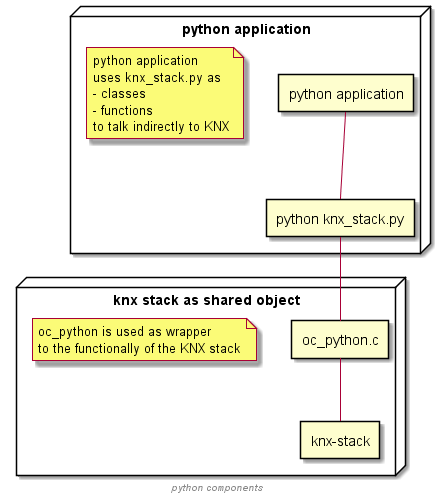
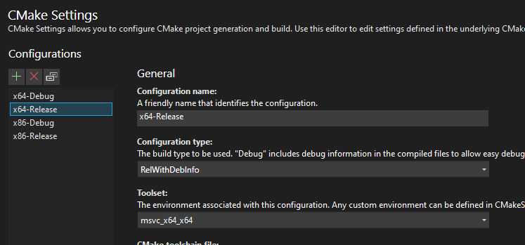
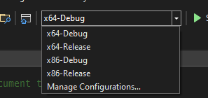

# Python bindings

The python bindings are based on python ctypes.
The python code is using the shared library (dll) containing an KNX-IOT stack based device that can act as an client.
The python code uses the device to interact with other KNX-IOT devices on the network.



## requirements

- windows based machine (Win10 or Win11)
- visual studio compiler (can be community edition)
- cmake environment
- python

### install python requirements

python -m pip install -r requirements.txt

## Build Shared Library on Linux

run the following command from the build directory in a git bash shell:

```bash
cmake .
```

## Build Shared Library on Windows for debugging

Retrieving all code that is needed for building (in bash):

```bash
# retrieve the repo from github
git clone https://github.com/KNX-IOT/KNX-IOT-STACK.git
# go to the created folder
cd KNX-IOT-STACK
# make sure that all dependencies are downloaded as well
git submodule update --init --recursive
```

getting the visual studio environment:

This batch file opens a windows developer shell that knows all paths of visual studio.

```bash
start_shell.bat
```

In this shell issue the commands to build the applications (in this folder).
The first command the configuring command for the stack.
e.g. this checks the visual studio environment and creates the nmake based make file that enables building the stack.

```bash
cmake -G"NMake Makefiles" .. -DOC_OSCORE_ENABLED=true
nmake
```

Building without security, use the command line option to disable OSCORE

```bash
cmake -G"NMake Makefiles" .. -DOC_OSCORE_ENABLED=false
nmake
```

The nmake command builds the windows shared library (dll).
The python code can be used directly from this (build) folder.

```bash
python knx_stack.py
```

### commandline arguments

debugging with visual studion:
adding command line options to the application can be done via the visual studio add-on:

https://marketplace.visualstudio.com/items?itemName=MBulli.SmartCommandlineArguments

or add to the launch.vs.json file the args section in the configuration.

```
  {
      "type": "default",
      "project": "CMakeLists.txt",
      "projectTarget": "testserver_all.exe (apps\\testserver_all.exe)",
      "name": "testserver_all.exe (apps\\testserver_all.exe)",
      "args": [
        "reset"
      ]
    }
```

## Build Shared Library on Linux

Within the build directory:

```bash
# in the pythonbindings folder
cmake ..
make
python knx_stack.py
```

### known issues

#### building with visual studio 2019

Note that the windows dll is build for win32 or x64, depending on the default installation of visual studio (e.g. visual studio 2019)
Hence the python interpreter MUST match that.

Both combinations (win32 and x64) are known to work.

For more information: https://stackoverflow.com/questions/48000185/python-ctypes-dll-is-not-a-valid-win32-application

#### building with visual studio 2020

Visual studio 2020 has improved support for Cmake.
Select the debug and/or release targets in CMake:

Then select the build in visual studio:


### build dir changes

Assuming the build directory has been configured correctly, this command ensures that the latest version of the scripts are copied into the build dir.
Since the scripts are copied at configure time, you need to use this command whenever you want to test a change to the scripts, or you will see the old behaviour instead.
